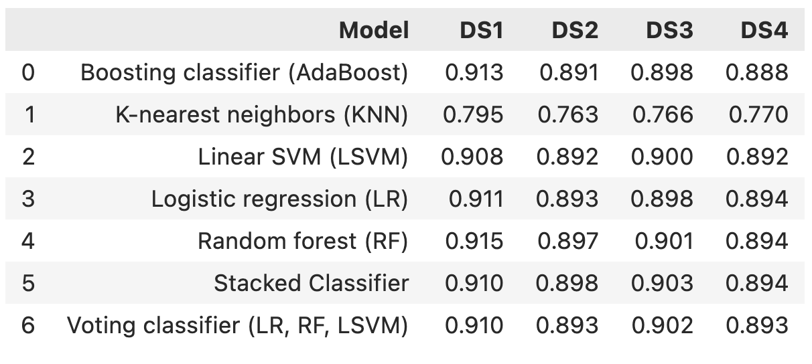

Table of Content

[TOC]

TODOs

- Result discussion 
- Results comparison 
- Discussion section 
- Reference 

> Abstract:
>
> The widespread dissemination of fake news has become a significant concern in the digital age, necessitating the development of effective machine learning techniques for its detection. This paper presents a comprehensive comparative analysis of various machine learning models applied to a fake news detection dataset. The dataset consists of labeled news articles, and popular algorithms such as decision trees, support vector machines, random forests, logistic regression, and neural networks are evaluated. Performance metrics including accuracy, precision, recall, and F1 score are employed to assess model performance, with a focus on handling imbalanced classes. The findings of this study offer insights into the strengths and limitations of different approaches, aiding researchers and practitioners in identifying effective models for combating fake news dissemination. This research contributes to advancing the field of misinformation detection and serves as a foundation for future developments in this critical area.
>
> *Keywords:* fake news, machine learning, comparative analysis, performance evaluation, classification models, dataset, decision trees, support vector machines, random forests, logistic regression, neural networks, accuracy, precision, recall, F1 score, imbalanced classes, misinformation detection, model comparison.

## Introduction

The proliferation of misinformation and fake news has become a critical issue in today's digital era. The spread of deceptive information poses significant challenges to individuals, organizations, and society as a whole. As a result, the development of effective techniques for fake news detection has gained considerable attention in the field of machine learning.

This paper aims to provide a comprehensive comparative analysis of various machine learning models for fake news detection. The objective is to assess the performance of different models in accurately classifying news articles as either genuine or fake, based on a carefully curated dataset specifically designed for this task.

To conduct this study, we have selected a diverse set of popular machine learning algorithms, including but not limited to decision trees, support vector machines (SVM), random forests, logistic regression, and neural networks. These models represent a wide range of approaches, capturing both traditional and advanced techniques for classification.

The dataset used for evaluation comprises a substantial collection of labeled news articles, with each instance annotated as either real or fake. The dataset encompasses various textual features, such as headline, body text, author, and source information, which can be leveraged by the models to extract meaningful patterns and make accurate predictions.

Our analysis focuses on key evaluation metrics, such as accuracy, precision, recall, and F1 score, to assess the performance of each model. Additionally, we also investigate the models' ability to handle imbalanced classes, as fake news instances are typically much rarer compared to genuine news.

By comparing the results of different machine learning models on the fake news detection dataset, this research aims to shed light on the strengths and weaknesses of various approaches. The findings of this study can provide valuable insights for researchers and practitioners working in the field of misinformation detection and help in identifying the most effective models for tackling the challenge of fake news.

Overall, this paper contributes to the growing body of literature on fake news detection by providing a rigorous comparative analysis of machine learning models. It serves as a foundation for future research and advancements in developing more robust and accurate techniques to combat the spread of fake news. 

## Materials and Methods

### Proposed Framework

> Figure 1: Workflow of the Framework

There are 4 phases in our framework: preprocessing,  hyperparameter tuning, model training, and model evaluation. 

#### Preprocessing

- Language Detection to remove non-English news 

Our dataset included news written in a language other than English. Considering the volume of the dataset and ease in the stemming, we removed all the datasets written in non-English by using language detection from langdetect. 

- Removing entries with NA

After performing the language detection, all the entries with at least one missing value were removed. 

- Stemming 

We implemented stemming to our dataset as it removes prefixes and suffixes from a word, and thus thereby reudces words to their root form. In our data preprocessing, Porter Stememr was employed, which reduces words like: "running" and "runs" to "run," and "runner" to "runner." By transforming words into a common base form, we are able to increase simplicity and decrease volume. Yet, due to the length of dataset and size of each entry, stemming was only performed within the title variable.

- Sampling 

For the purpose of evaluating models rigorously, we created multiple test datasets. To do so, among the 5000 randomly chosen samples from the original dataset, we assigned an index for each of the entries; for instance, the index of the first 1000 entries was 0, and the index of the following 1000 entries was 1. Then, after indexing the data, entries with the same index were grouped. In our model, index 0 refers to the training dataset and indices 1, 2, 3, and 4 refer to testing sets 1, 2, 3, and 4 respectively. 

#### Hyperparameter Tuning

Hyperparameter tuning is a crucial step in building a machine learning model. It involves selecting the best set of hyperparameters that optimize the performance of the model. Hyperparameters are parameters that are not learned during training, but rather set manually before training begins. Examples of hyperparameters include learning rate, batch size, and regularization strength.

To perform hyperparameter tuning, we first define a range of possible values for each hyperparameter. We then evaluate the model's performance using different combinations of hyperparameters. This process can be performed manually or through automated methods such as grid search, random search, or Bayesian optimization.

The goal of hyperparameter tuning is to find the set of hyperparameters that result in the best performance on a validation dataset. However, it's important to avoid overfitting to the validation set during this process, as this can lead to poor generalization performance on new data. One way to avoid overfitting is to use a separate test set to evaluate the final performance of the selected hyperparameters.

#### Model Training

After finding the best hyperparameters through the tuning phase, we proceed with the model training phase. In this phase, we use the selected hyperparameters to train our model on a training dataset. The model is optimized to minimize the error between the predicted output and the actual output. This process is repeated for several epochs until the model converges and the error on the validation set stops improving.

There are several optimization algorithms that can be used during training, such as stochastic gradient descent, Adam, and Adagrad. The choice of optimization algorithm depends on the characteristics of the dataset and the model architecture.

#### Model Evaluation

Finally, during the model evaluation phase, we defined some utility functions in the `utils.py` file to automate model prediction and evaluation. The structure of functions is described here. 

> Figure 2: Outline of Model Prediciton and Evaluation

To make data flow in these functions more readable, we defined some data structures to package values. 

> Figure 3: Data Structures to Facilitate Data Flow

Equiped with these utility functions, model training and evaluation can be efficiently automated by the minimal amout of codes as below. 

> Figure 4: Example of Model Training and Evaluation

This workflow will be applied to all the models that we will discuss in the next section. After training and evaulating the models, we will test models on 4 different test data sets. 

#### Models

##### Logistic regression

Logistic regression is a supervised classification method that uses the Bernoulli distribution and the sigmoid function to predict the binary discrete values such as true/false and yes/no. In this work, we trained the logistic regression model with default parameters. 

##### Linear SVM

Linear SVM (Support Vector Machine) is a machine learning algorithm that separates data points into different classes by finding the best hyperplane (decision boundary) that maximizes the margin between the classes. It achieves this by identifying support vectors, which are the data points closest to the decision boundary. Linear SVM aims to find the optimal hyperplane that maximally separates the classes while minimizing classification errors. It maps the input data into a higher-dimensional space using a linear function and employs a margin-based loss function to optimize the placement of the decision boundary. The resulting model can be used for predicting the class of new, unseen data points based on their features.

##### K-nearest neighbors

K Nearest Neighbours (KNN) is a non-parametric classification algorithm with simplicity and effectiveness. The algorithm operates by aggregating the outcomes of the k nearest neighbors from the training dataset to classify a new observation. In KNN, the selection of the optimal value of k is a critical step as it directly impacts the trade-off between bias and variance. Specifically, a small value of k leads to high variance and low bias, while a large value of k results in high bias and low variance. To determine the optimal value of k, the cross-validation method is employed in our model.

##### Random Forest

Random Forest is a powerful machine learning algorithm that combines multiple decision trees to make accurate predictions or classifications. It works by creating a "forest" of randomized decision trees, where each tree is trained on a different subset of the data and uses a random subset of features. The algorithm then aggregates the predictions from all the trees to produce the final result, taking advantage of their collective wisdom. Random Forest is known for its ability to handle large datasets, high-dimensional features, and nonlinear relationships, while also providing robustness against overfitting and noise.

#### Ensemble Learners

##### Voting Classifier

A Voting Classifier is a machine learning ensemble method that combines the predictions of multiple individual classifiers to make a final prediction or classification. It works by having each classifier independently make predictions on the input data, and then the final prediction is determined by a majority vote (for classification tasks) or by averaging the predicted probabilities (for probability-based predictions). The Voting Classifier can incorporate different types of classifiers, such as decision trees, support vector machines, or neural networks. This ensemble approach helps to improve the overall accuracy and generalization of the prediction by leveraging the collective knowledge of the individual classifiers.

The voting classifier used in this project has the following structure. 

##### Stack Classifier

A Stack Classifier, also known as a Stacked Ensemble, is a machine learning technique that combines the predictions of multiple diverse base classifiers using a meta-classifier to make final predictions or classifications. Unlike the Voting Classifier, which performs a majority vote or averaging, the Stack Classifier learns how to best combine the predictions from the base classifiers by training a meta-classifier on their outputs.

The Stack Classifier works in multiple stages. In the first stage, the base classifiers are trained on the input data independently. Each base classifier may use different algorithms or have different configurations to introduce diversity in their predictions. In the second stage, the predictions of the base classifiers are combined into a new feature set, which serves as input to the meta-classifier. The meta-classifier is then trained on this augmented feature set to make the final predictions.

By combining the predictions of diverse base classifiers and learning how to weight and combine them effectively, the Stack Classifier can potentially achieve better performance and improve generalization compared to using individual classifiers alone. It is often used in complex tasks or when there is a need to squeeze out additional predictive performance from the ensemble.

##### AdaBoost

AdaBoost is a boosting algorithm that iteratively combines weak classifiers to create a strong classifier. It starts by assigning equal weights to each instance in the training set. In each iteration, a weak classifier is trained on the data, giving more weight to misclassified instances from the previous iteration. This iterative process continues until a predefined number of weak classifiers is reached. Finally, the weak classifiers are combined using a weighted majority voting scheme, where their votes are weighted based on their accuracy. The resulting strong classifier is more accurate and robust than the individual weak classifiers. AdaBoost is known for its ability to handle complex problems and handle class imbalance, although it can be sensitive to outliers.

### Benchmark Algorithms.

### Datasets

The dataset used to distinguish whether the news is fake or true is from “Fake News” dataset of Kaggle, designed for the Community Prediction Competition. While the page provides three types of data set — train, test, and submit — in csv format, we are only using the train.csv dataset. 

Dataset includes index of each entry by order (id), the headline of the news article (title), the body of the news article (text), and an index of each entry based on the likelihood of the news article being false (label). The label, which plays a crucial role in categorizing fake news, has two categories: 0 (unreliable news) and 1 (reliable news). 

### Performance Metrics

Metrics play a crucial role in model evaluation by providing quantitative measures to assess the performance and effectiveness of machine learning models. These metrics serve as objective indicators that help to understand how well a model is performing and to compare different models or variations of a model.

#### Accuracy

Accuracy is a metric that measures the overall correctness of a classification model by calculating the percentage of correctly predicted instances out of the total number of instances.
$$
\text{Accuracy} = \frac{TP + TN}{TP+TN+FP+FN}
$$

#### Recall

Recall is a metric that measures the ability of a classification model to correctly identify positive instances out of all actual positive instances.
$$
\text{Recall} = \frac{TP}{TP+FN}
$$

#### Precision

Precision is a metric that measures the accuracy of a classification model in predicting positive instances by calculating the percentage of correctly predicted positive instances out of all predicted positive instances.
$$
\text{Precision} = \frac{TP}{TP+FP}
$$

#### F1-score

The F1 score is a metric that combines precision and recall to provide a balanced measure of a classification model's performance. It calculates the harmonic mean of precision and recall, providing a single value that represents the model's overall accuracy and ability to correctly classify positive instances while minimizing false positives and false negatives.
$$
\text{F1} = 2 \frac{\text{Precision}\times \text{Recall}}{\text{Precision}+ \text{Recall}}
$$

## Results and Discussion

> Figure 5: Accuracy, precision, recall, and F1-score over all datasets.

> Table 1: Accuracy on the 4 datasets.

> Table 2: Precision on the 4 datasets.

> Table 3: Recall on the 4 datasets.

> Table 4: f1-score on the 4 datasets. 

## Discussion

## References