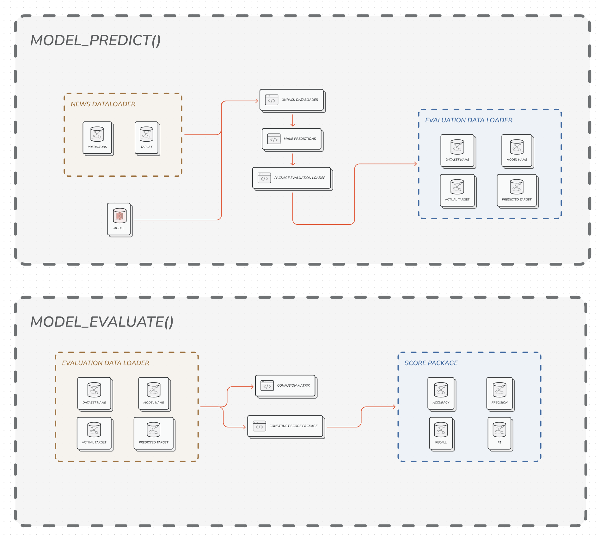

> Abstract:
>
> This paper presents a comparative analysis of machine learning models for fake news detection. The study evaluates popular algorithms using a curated dataset of labeled news articles with diverse textual features. Performance metrics such as accuracy, precision, recall, and F1 score are used to assess the models' performance, with a focus on handling imbalanced classes. The findings provide valuable insights for researchers and practitioners in the field, contributing to the development of more effective techniques for combating fake news.
>
> *Keywords:* fake news, machine learning, comparative analysis, performance evaluation, classification models,, decision trees, support vector machines, random forests, logistic regression, neural networks, accuracy, precision, recall, F1 score.

# Fake News Detection Using Machine Learning Methods

Github Repo: https://github.com/austinyu/STA395-Final-Project

## Introduction

The proliferation of misinformation and fake news is a critical issue in today's digital era. This paper provides a comprehensive analysis of machine learning models for fake news detection. We evaluate various models, including decision trees, support vector machines, random forests, logistic regression, and neural networks. Our dataset consists of labeled news articles with textual features. We assess the models using key metrics like accuracy, precision, recall, and F1 score, considering the challenge of imbalanced classes. By comparing the results, this research highlights the strengths and weaknesses of different approaches, aiding researchers and practitioners in the field. Ultimately, this study contributes to advancing techniques for combating fake news.

## Materials and Methods

### Proposed Framework

> Figure 1: Workflow of the Framework

There are 4 phases in our framework: preprocessing,  hyperparameter tuning, model training, and model evaluation. 

#### Preprocessing

- Language Detection to remove non-English news 

Our dataset included news written in a language other than English. Considering the volume of the dataset and ease in the stemming, we removed all the datasets written in non-English by using language detection from langdetect. 

- Removing entries with NA

After performing the language detection, all the entries with at least one missing value were removed. 

- Stemming 

Stemming was applied to our dataset using Porter Stemmer to reduce words to their root form, increasing simplicity and reducing volume. However, stemming was limited to the title variable due to dataset size and entry length (Singh & Gupta, 2017, p.163-164).

- Sampling 

Multiple test datasets were created to rigorously evaluate the models. From the original dataset of 5000 randomly chosen samples, each entry was assigned an index. Entries were grouped based on their assigned index, with index 0 representing the training dataset and indices 1, 2, 3, and 4 representing testing sets 1, 2, 3, and 4 respectively.

#### Hyperparameter Tuning

Hyperparameter tuning is a crucial step in machine learning model development. It involves selecting the optimal values for parameters such as learning rate, batch size, and regularization strength. This is achieved by evaluating the model's performance with different hyperparameter combinations. Hyperparameter tuning can be done manually or through automated methods like grid search or random search. The goal is to find the best hyperparameter set using a validation dataset, while avoiding overfitting by evaluating final performance on a separate test set.

#### Model Training

After finding the best hyperparameters through the tuning phase, we proceed with the model training phase. In this phase, we use the selected hyperparameters to train our model on a training dataset. The model is optimized to minimize the error between the predicted output and the actual output. This process is repeated for several epochs until the model converges and the error on the validation set stops improving.

There are several optimization algorithms that can be used during training, such as stochastic gradient descent, Adam, and Adagrad. The choice of optimization algorithm depends on the characteristics of the dataset and the model architecture.

#### Model Evaluation

Finally, during the model evaluation phase, we defined some utility functions in the `utils.py` file to automate model prediction and evaluation. The structure of functions is described here. 

> Figure 2: Outline of Model Prediciton and Evaluation

To make data flow in these functions more readable, we defined some data structures to package values. 

> Figure 3: Data Structures to Facilitate Data Flow

Equiped with these utility functions, model training and evaluation can be efficiently automated by the minimal amout of codes as below. 

> Figure 4: Example of Model Training and Evaluation

This workflow will be applied to all the models that we will discuss in the next section. After training and evaulating the models, we will test models on 4 different test data sets. 

#### Models

##### Logistic regression

Logistic regression is a supervised classification method that predicts binary outcomes using the Bernoulli distribution and sigmoid function.

##### Linear SVM

Linear SVM (Support Vector Machine) is a machine learning algorithm that separates data points into different classes by finding the best hyperplane (decision boundary) that maximizes the margin between the classes. It achieves this by identifying support vectors, which are the data points closest to the decision boundary. Linear SVM aims to find the optimal hyperplane that maximally separates the classes while minimizing classification errors. It maps the input data into a higher-dimensional space using a linear function and employs a margin-based loss function to optimize the placement of the decision boundary. The resulting model can be used for predicting the class of new, unseen data points based on their features.

##### K-nearest neighbors

KNN (K-Nearest Neighbors) is a supervised classification model that assigns labels to data points based on the majority vote of their k nearest neighbors.

##### Random Forest

Random forest is an ensemble learning model that combines multiple decision trees to make predictions by aggregating their outputs.

#### Ensemble Learners

##### Voting Classifier

Voting classifier is an ensemble learning model that combines predictions from multiple individual classifiers by majority voting.

The voting classifier used in this project has the following structure. 

##### Stack Classifier

Stack classifier is an ensemble learning model that combines predictions from multiple individual classifiers using another classifier to make the final prediction.

##### AdaBoost

AdaBoost (Adaptive Boosting) is an ensemble learning model that iteratively trains weak classifiers on weighted versions of the data to create a strong classifier.

### Benchmark Algorithms.

Among the models evaluated, including Linear SVM, KNN, Random Forest, Voting Classifier, and AdaBoost, the stacked classifier demonstrated the highest classification accuracy. The stacked classifier combines predictions from multiple individual classifiers using another classifier, allowing it to leverage the strengths of different models and potentially achieve better performance. While the performance of all models was comparable, the stacked classifier stood out as the top performer in terms of accuracy, indicating its effectiveness in accurately classifying data points.

### Datasets

The dataset used to distinguish whether the news is fake or true is from “Fake News” dataset of Kaggle, designed for the Community Prediction Competition. While the page provides three types of data set — train, test, and submit — in csv format, we are only using the train.csv dataset. 

Dataset includes index of each entry by order (id), the headline of the news article (title), the body of the news article (text), and an index of each entry based on the likelihood of the news article being false (label). The label, which plays a crucial role in categorizing fake news, has two categories: 0 (unreliable news) and 1 (reliable news). 

### Performance Metrics

Metrics play a crucial role in model evaluation by providing quantitative measures to assess the performance and effectiveness of machine learning models. 

#### Accuracy

Accuracy is a metric that measures the overall correctness of a classification model by calculating the percentage of correctly predicted instances out of the total number of instances.
$$
\text{Accuracy} = \frac{TP + TN}{TP+TN+FP+FN}
$$

#### Recall

Recall is a metric that measures the ability of a classification model to correctly identify positive instances out of all actual positive instances.
$$
\text{Recall} = \frac{TP}{TP+FN}
$$

#### Precision

Precision is a metric that measures the accuracy of a classification model in predicting positive instances by calculating the percentage of correctly predicted positive instances out of all predicted positive instances.
$$
\text{Precision} = \frac{TP}{TP+FP}
$$

#### F1-score

The F1 score is a metric that combines precision and recall to assess the overall performance of a classification model.
$$
\text{F1} = 2 \frac{\text{Precision}\times \text{Recall}}{\text{Precision}+ \text{Recall}}
$$

## Results

### Overall Results

Figure 5 displaces the overall results of our models, showing the average value of the four metrics of each model on the four test sets.Generally speaking, all seven models perform well in decting fake news and categorizing them with a rather high accuracy. However, it is worth noting that the KNN classifier seems to perform the worst in our data sets, with the lowest accuracy, f1-score, and recall. Although the average recall across the test sets for KNN classifier is 0.65, which is not unacceptablly low, this still suggests that the KNN classifier is identifying a substantially higher number of false negatives when comparing with the other models. Besides that, AdaBoost model and Voting classifier seem to outperform the others, as their precision are among the highest while maintaining a roughly similar high level of accuracy, fl-score, and recall.

> Figure 5: Accuracy, precision, recall, and F1-score over all datasets.

### Result Comparison

Table 1 shows the precision achieved by each model on the four test sets.KNN classifier can be immediately identified as the underperforming model, as its accuracies are under 80% across all four test sets. The other six models have a very close performance, with the mean centered at a 90% mark.

> Table 1: Accuracy on the 4 datasets.

Table 2 shows the accuracy achieved by each model on the four test sets. We see that every model has achieved an average precision score higher than 95%. This indicates that all of our seven models are extremely accurate of positive predictions. KNN classifier achieved the highest average accuracy across the test sets, followed by AdaBoost classifier.

> Table 2: Precision on the 4 datasets.

Table 3 shows the recall achieved by each model on the four test sets. Again, KNN classifier is  identified as the underperforming model, as its recall are under 0.70 across all four test sets. The other six models have a very close performance around 0.8 average recall, but Stacked classifier managed to achieve the highest average testing recall.

> Table 3: Recall on the 4 datasets.

Table 4 shows the f1-score achieved by each model on the four test sets. Once again, KNN classifier has the worst performance, non of its f1-score surpasses 0.8. The other six models have a very close performance, with the mean f1-score centered at around 0.9.

> Table 4: f1-score on the 4 datasets. 

## Discussion

Preprocessing plays a crucial role in NLP machine learning, particularly in fake news detection, by reducing the computational burden through techniques like stemming. This improves the efficiency and performance of models. In our study, we found that the different models exhibited similar performance across various evaluation metrics such as accuracy, precision, recall, and F1 score. This suggests that each model was effective in detecting fake news to a similar degree. Therefore, choosing a model should consider factors beyond performance metrics, such as model complexity and interpretability. We observed that precision values were consistently higher than recall values for fake news detection, indicating a focus on minimizing false positives at the expense of potentially missing some actual fake news. This highlights the challenge of balancing precision and recall in fake news detection models. While accuracy is commonly used, the imbalanced nature of fake news datasets makes it misleading. In our study, we utilized the F1 score, which considers both precision and recall, providing a more balanced evaluation of model effectiveness. The consistency between accuracy and the F1 score suggests reliable model performance. Ultimately, effective preprocessing and careful consideration of evaluation metrics contribute to accurate fake news detection.

## References

Ahmad, I., Yousaf, M., Yousaf, S., & Ahmad, M. O. (2020). Fake news detection using machine learning ensemble methods. Complexity, 2020, 1-11.

Singh, J., Gupta, V. A systematic review of text stemming techniques. Artif Intell Rev 48, 157–217 (2017). https://doi.org/10.1007/s10462-016-9498-2.